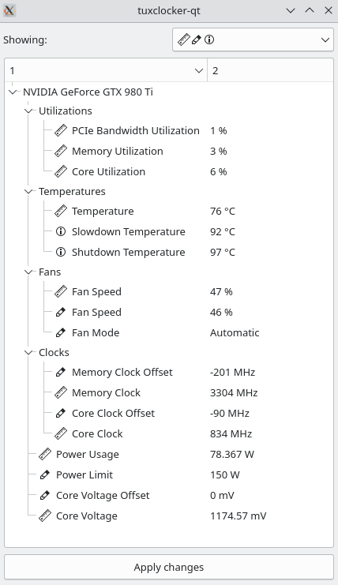
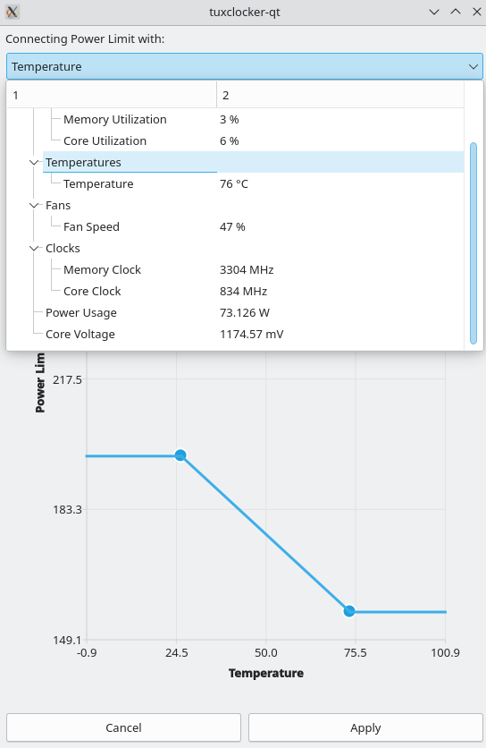
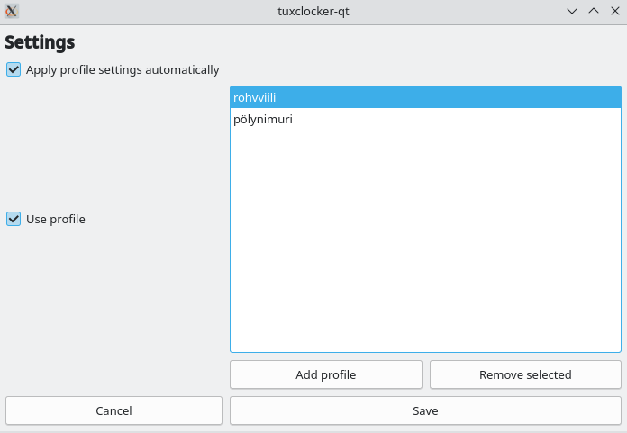

# About
TuxClocker is a hardware controlling and monitoring program. TuxClocker consists of a DBus daemon and a Qt GUI that uses the daemon.

## Chat
If you have any questions or suggestions, you can join the chat on [Matrix](https://matrix.to/#/#tuxclocker:matrix.org) or [IRC](https://webchat.oftc.net/?nick=&channels=%23tuxclocker&uio=d4)

You can use IRC if you don't want to create an account. Both chats are bridged between each other.

## Translations
TuxClocker uses GNU gettext for translations. You can use [Weblate](https://hosted.weblate.org/projects/tuxclocker/) or edit them locally, and make a pull request.

## Features
- Supports any number of devices at once
- Read and write device properties (Click on a selected node to edit)
- Edit multiple similar nodes at once by selecting them and starting editing
- Connect any writable property to any readable property, for more possibilities than just fan curves. Currently only possible with range-based writable properties (Right click on a node)
- Reset writable properties to default (Right click on a node)
- Profiles
- Option to apply profile settings on startup/profile change

### Currently missing from earlier releases
These are missing from the 1.3.0 release, but present in the 0.1.1 release.
Refer to the [0.1.1 release readme](https://github.com/Lurkki14/tuxclocker/tree/76369ef24283364b4111c5970797062432044cbc) if you wish to use these.

- Graphs for properties

## Currently supported devices and features

### Nvidia GPUs

#### 600 -series and above
- Support for multiple fans on one GPU
- Fan mode
- Fan speed
- Core and memory clocks (Xorg only)
- Power limit
- Temperatures
- Utilizations
- VRAM usage monitoring

#### 600 to 900 -series
- Voltage setting and reading (Xorg only)

### AMD GPUs
NOTE ABOUT AMD GPUS:

When writing to `pp_od_clk_voltage` (writable properties in the 'Performance' subtree), `power_dpm_force_performance_level` is implicitly set to 'Manual'. Normally this shouldn't matter, but if you set 'Performance Parameter Control' to anything other than 'Automatic' or 'Manual' you may get unexpected results due to the value being overridden by other settings. You can work around this by removing the setting values from your profile by right clicking on the properties.
#### Radeon HD 7000 -series and above (with amdgpu driver)
- Temperatures
- Fan mode
- Fan speed
- Core and memory clock reading
- Performance parameter control (power_dpm_force_performance_level)
- VRAM usage monitoring

#### Vega-series and above
- Voltage monitoring
- Utilizations

#### Vega-series
- Memory and core performance state editing (discrete clock-voltage points)

#### Navi-series and above
- Minimum and maximum core clock editing
- Minimum and maximum memory clock editing

#### Navi-series
- Voltage-frequency curve editing for core clocks

#### RX 6000 -series + ?
- Voltage offset setting

### CPUs
Some CPU features require kernel module `msr` to be loaded.

- Frequency monitoring
- Utilization monitoring
- CPU Governor setting
- CPU Governor minimum/maximum frequency setting

### AMD and Intel CPUs
- Energy-Power Preference setting (called 'Power Usage Mode' in the program)
- Power usage monitoring (MSR)

### Intel CPUs
- Temperature monitoring (coretemp)
- Energy-Performance Bias setting (called Power Saving Tendency in the program)
- Core and memory power usage monitoring (MSR)
- Voltage monitoring (MSR)

## Possible future improvements
- Support for more devices
- Support for more platforms than Linux
- Easier to discover UI
- CLI interface

# Installation

## Prerequisites
NVIDIA GPUs require [Coolbits](https://wiki.archlinux.org/index.php/NVIDIA/Tips_and_tricks#Enabling_overclocking) set to enable editing of most writable properties (31 for all functionality)

AMD GPUs require the [amdgpu.ppfeaturemask](https://wiki.archlinux.org/title/AMDGPU#Boot_parameter) boot parameter to edit writable properties (`amdgpu.ppfeaturemask=0xffffffff` for all functionality)

## Using prebuilt binaries
You can use the `tuxclocker.tar` from the release page if you don't want to compile. The tarball is generated from the `mkTarball.sh` script.

- Download the tarball into some empty directory
- Extract the contents eg. (`tar xf tuxlocker.tar`)
- For NVIDIA users, run `./nvidiaInstall.sh` before running to get suitable NVIDIA libraries through Flatpak
- Run `sudo echo && ./run.sh` in the same folder (sudo is needed for the daemon)

## Using distribution packages
This list may contain unofficial distribution packages, maintained by other people not directly related with this project.

#### For openSUSE Tumbleweed
NOTE: Due to NVIDIA proprietary driver license problems the package is built without NVIDIA modules. See [issue#65](https://github.com/Lurkki14/tuxclocker/issues/65) for more info.

Install the [tuxclocker](https://software.opensuse.org//download.html?project=home%3Atujhen%3Atuxclocker&package=tuxclocker) package from OBS. Or via terminal:
```
sudo zypper in opi
opi tuxclocker
```

#### For Arch Linux
Available on [AUR](https://aur.archlinux.org/packages/tuxclocker)

## Dependencies

Required: `qt (charts, base, dbus), boost-system, boost-filesystem, meson`

Optional:

- `libnvml, libxnvctrl, xlib` - NVIDIA support
- `libdrm` - AMD support
- `python-hwdata, libpython3, python3` - Prettier AMD GPU names

NOTE: some distros like NixOS only contain `libnvml` as part of a fully featured CUDA package.

Note that these packages are likely called something different on each distribution.

#### For Nix

`nix-shell release.nix`

#### For Ubuntu

`python-hwdata` is not packaged for Ubuntu but can be acquired on [OBS](https://build.opensuse.org/package/show/home:alvistack/xsuchy-python-hwdata-2.4.1).
```
sudo apt install --yes --quiet --quiet \
    libqt5x11extras5-dev \
    qtbase5-dev \
    libqt5x11extras5 \
    libdrm-amdgpu1 \
    libdrm-common \
    libdrm-dev \
    nvidia-utils-440-server \
    nvidia-settings \
    libxnvctrl-dev \
    libssl-dev \
    libboost-filesystem-dev \
    qttools5-dev-tools \
    libqt5charts5-dev \
    libboost-dev
```

#### For openSUSE Tumbleweed
`python-hwdata` is not packaged for openSUSE but can be acquired on [OBS](https://build.opensuse.org/package/show/home:tujhen:tuxclocker/python-hwdata).
```
sudo zypper in -y \
    meson \
    git \
    gettext-runtime \
    gcc-c++ \
    libboost_system-devel \
    libboost_filesystem-devel \
    libdrm-devel \
    libXNVCtrl-devel \
    libX11-devel \
    libQt5DBus-devel \
    libQt5Charts5-devel \
    libqt5-qtbase-devel \
    libopenssl-devel \
    python311-devel \
    python311-hwdata \
    nvidia-compute-G06
```


## Compiling

#### Meson options

```
--prefix=<path> (install location prefix, usually '/usr')
-Dplugins=<true/false>
-Ddaemon=<true/false> (builds and installs 'tuxclockerd' binary/daemon)
# The following options allow you to abort the build if some components can't be built
-Drequire-nvidia=<true/false>
-Drequire-amd=<true/false>
-Drequire-python-hwdata=<true/false>
```

#### Clone, build and install

```
git clone https://github.com/Lurkki14/tuxclocker
cd tuxclocker
git submodule init
git submodule update
meson build <meson options>
cd build
ninja && sudo ninja install
```

#### Running
Once you have installed everything into a proper location, TuxClocker is available through a launcher or with `tuxclocker-qt` from the terminal.

If TuxClocker shows up with no items, there may be a problem with connecting to the DBus daemon. Refer to your system documentation on where DBus system service entries should be located. Alternatively, you can launch the needed components manually as explained in the Developing/Scripts section of the README.

# Screenshots

### Main view



### Editing an item


### Parametrizing an item


### Showing pending changes


### Settings


# Developing

### Formatting

TuxClocker uses `clang-format`. Code should be formatted with the provided `clangFormat.sh` script.

NOTE: to get designated initializers formatted like so:
``` cpp
auto Foo = Foo{
    .bar = 1,
    .baz = 2,
};
```
a trailing comma should be used after the last member (`clang-format` weirdness).

### Scripts

There are a few scripts in `dev/` for development convenience, mainly to deal with DBus. A separate DBus instance and custom config file is used, so the TuxClocker daemon is able to be registered without installing service files into the system.

Note: the following scripts assume TuxClocker is installed to `inst/` and libraries to `inst/lib` so `meson` should be called as follows:

`meson build --prefix=$(pwd)/inst -Dlibdir=lib`


The scripts should be used in this order (they all have to be running simultaneously, so probably best to run in separate terminals):

`dev/dbus-start.sh` Starts a separate DBus instance.

`dev/tuxclockerd-start.sh` Launches `tuxclockerd` making it connect to our separate DBus instance and LD_LIBRARY_PATH set to find the built `libtuxclocker`.

`dev/gui-start.sh` Launches the TuxClocker GUI making it connect to our separate DBus instance, so it can find the TuxClocker DBus service.

You can also use a program like `d-feet` if you are only making changes to the daemon. (To be documented)

### License
GPL-3 only
